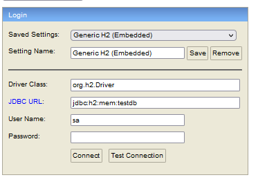

## Load Instructions


---


### Setup

I am using H2 Database. I have two files data.sql and schema.sql.  This will create a db(H2) database and populate with the relevant data when the application is run everytime. 
Application.properties has the configuration to communicate with the H2 database

After running the application 
run this
http://localhost:8080/h2-console/login.do?jsessionid=2a13790017a535cc0013e4533c3df623 on the browser it will start the h2 database, 


The screen below will appear and those are the credentials no password


###POST API
### Add new drones

http://localhost:8080/api/v1/drone

you pass the json body 
````
{
"serialNumber": "123wttr41",
"model": "HEAVYWEIGHT",
"weightLimit": 400,
"battery": 90,
"state": "IDLE"
}
````
### load Drone
http://localhost:8080/api/v1/drone/1/load-drone
````
{
"medicationCode":"123E434T4"
}
````
---

***APIS description***

This are the apis in the application

###GET REQUESTS API***

***Get Drone state***

http://localhost:8080/api/v1/drone?state=loading

***Get Drone By ID***

http://localhost:8080/api/v1/drone/{pass-id}

***Get Drone loaded with which medicines***

http://localhost:8080/api/v1/drone/{pass-id}/loaded-meds

***Get All Drone***

http://localhost:8080/api/v1/drone

---

 **END** 
